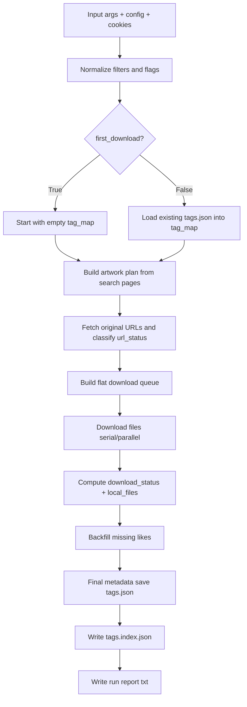
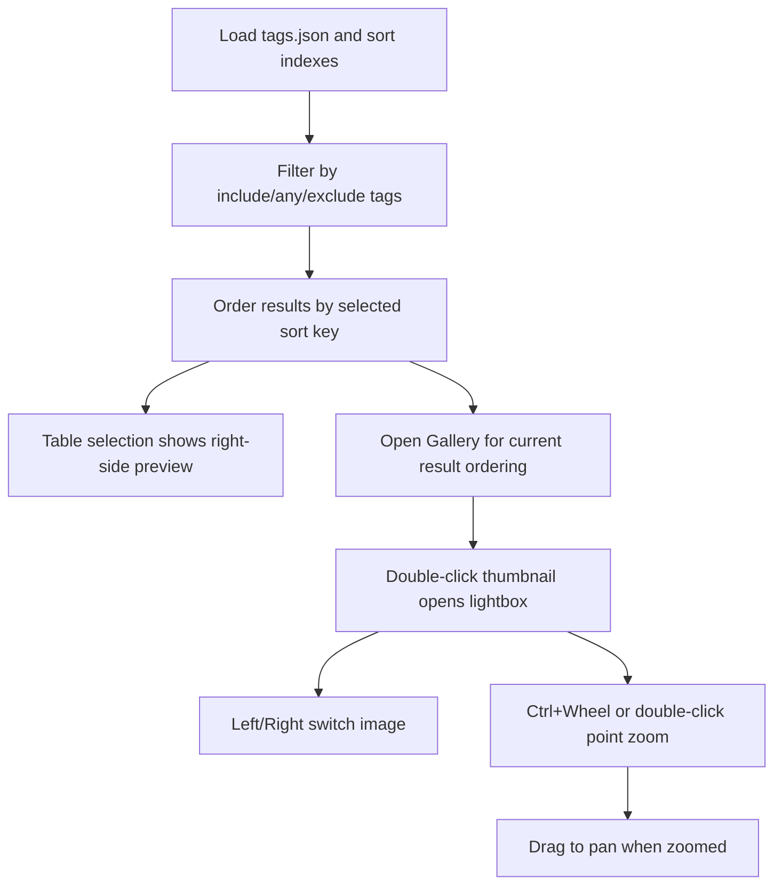

# Downloader Workflow and Data Structures

## Purpose
This document explains:
1. The current end-to-end workflow of the downloader.
2. How data is stored on disk.
3. Which data structures are used in code and why.
4. Time and space complexity of major operations.
5. How the offline local viewer uses local metadata/images only.

## Scope and Variables
The complexity discussion uses these symbols:
- `K`: number of search keywords.
- `P`: max pages requested per keyword.
- `R`: average results per search page.
- `A`: number of accepted artworks after filtering.
- `U`: total image URLs across accepted artworks (sum of page counts).
- `T`: average tag count per artwork.
- `M`: number of artworks with missing likes that need detail backfill.

## Current Downloader Workflow

### Workflow Illustration (High Level)



### 1) Input and Session Setup
- Parse user arguments and normalize filter inputs.
- Build HTTP session with cookies and headers.
- Determine search mode (`all` or `r18`).

Primary files:
- `pixiv_tag_download.py` (entry parameters)
- `pixiv_download.py` (orchestration)
- `pixiv_session.py` (session/retry)

### 2) Build Download Plan (Artwork-Level)
- For each keyword and each page:
  - Call Pixiv search API.
  - Deduplicate by artwork id.
  - Apply filters (`include_tags`, `any_tags`, `exclude_tags`, AI, R-18 settings).
  - Collect artwork metadata (author, date, initial likes, tags).
- Result: `planned_artworks` list.

### 3) Build Flat URL Queue (File-Level)
- For each planned artwork:
  - Fetch original image URLs using artwork pages endpoint.
  - Flatten all URLs into a single `download_tasks` list.
- Debug mode can print queue growth after each URL append.
- Metadata for each refreshed artwork is merged into `tag_map` during this phase.
- In incremental mode, old artworks may checkpoint-write metadata after refresh.

### 4) Download Phase
- If `num_threads == 1`: serial download.
- Else: parallel download with `ThreadPoolExecutor`.
- Save each successful file to disk.
- Track successful artwork ids and append file names to `local_files`.

### 5) Likes Backfill (Metadata Refresh Fallback)
- For artworks missing likes value:
  - Query artwork detail endpoint.
  - Fill likes when available.
- In incremental mode, checkpoints may be written during this stage.
- In first-download mode, like backfill updates stay in-memory and are written at final save.

### 6) Metadata Persist
- Final save writes `tags.json` atomically.
- Final save writes `tags.index.json` (precomputed sort indexes for `likes`, `post_date`, `artwork_id`).
- Run report is written as `download_run_YYYYMMDD_HHMMSS_mmmmmm.txt`.

### 7) Atomic Write Behavior (Windows-Safe)
- Atomic JSON write flow:
  1. write to a unique temp file (`<target>.<pid>.<thread>.tmp`)
  2. replace target with `os.replace`
  3. retry briefly on transient `PermissionError` (for file lock races)

## Data Storage Layout

### Image Files
- Stored under `dest_dir` from runtime config.
- Filenames are taken from Pixiv original URL basename.

### Metadata File (`tags.json`)
- Location: `dest_dir/tags.json`
- Type: JSON object keyed by artwork id.
- Value structure per artwork id:

```json
{
  "<artwork_id>": {
    "artwork_id": "...",
    "author_id": 123456,
    "author_name": "...",
    "post_date": "YYYY-MM-DD",
    "likes": 999,
    "tags": ["tag_a", "tag_b"],
    "local_files": ["123_p0.jpg", "123_p1.jpg"],
    "url_status": "ok|url_not_found|forbidden|request_error",
    "download_status": "downloaded|partial|download_failed|url_not_found|kept_local_missing_remote",
    "first_seen_at": "ISO8601",
    "last_refreshed_at": "ISO8601",
    "last_download_at": "ISO8601",
    "url_error": "optional error text"
  }
}
```

### Sort Index File (`tags.index.json`)
- Location: `dest_dir/tags.index.json`
- Contains precomputed `asc/desc` id lists for:
  - `likes`
  - `post_date`
  - `artwork_id`

This allows viewer sorting without re-sorting the full dataset every time.

### Run Report (`download_run_*.txt`)
- Location: `dest_dir`
- Includes timing, arguments snapshot, and run statistics.
- Filename uses microseconds and collision suffix fallback.

## Data Structures in Use

### A) `planned_artworks` (list of dict)
- Purpose: store accepted artworks before URL expansion.
- Why list: preserves traversal order and is efficient for append.
- Common operations:
  - append: amortized `O(1)`
  - iteration: `O(A)`

### B) `seen` (set)
- Purpose: deduplicate artworks by id during search scan.
- Why set: fast membership checks.
- Common operations:
  - membership (`pid in seen`): average `O(1)`
  - add: average `O(1)`

### C) `tag_map` (dict)
- Purpose: canonical metadata map during run and persisted to `tags.json`.
- Why dict: direct key-based access/updates by artwork id.
- Common operations:
  - set/get by key: average `O(1)`

### D) `download_tasks` (list of dict)
- Purpose: flat file-level work queue for downloader.
- Why list: efficient append and simple batch submit to thread pool.
- Common operations:
  - append: amortized `O(1)`
  - iteration/submit: `O(U)`

### E) `artwork_with_urls`, `successful_pids`, `new_artwork_ids`, `refreshed_pids` (set)
- Purpose:
  - `artwork_with_urls`: artworks with resolvable original URLs.
  - `successful_pids`: artworks with at least one successful file write.
  - `new_artwork_ids`: newly discovered artworks in this run.
  - `refreshed_pids`: artworks touched by URL-refresh stage.
- Operations: average `O(1)` membership/add.

### F) `expected_files_by_pid` and `downloaded_files_by_pid` (dict)
- Purpose:
  - expected image count per artwork from URL expansion.
  - successful file count per artwork from download stage.
- Used to compute `download_status` precisely.

### G) Thread-local session objects
- Variables:
  - `_THREAD_LOCAL` (`threading.local`)
  - `_THREAD_START_LOCK`, `_THREAD_START_INDEX`
- Purpose:
  - one HTTP session per worker thread.
  - controlled startup spacing (`thread_delay`) to avoid burst spikes.

### H) Futures list (`futures`)
- Purpose: hold asynchronous tasks from `ThreadPoolExecutor`.
- Processing with `as_completed` gives completion-order handling.

## Complexity by Stage

### 1) Plan Build
Main loop complexity is dominated by search pages and per-item filtering:
- Search scan: `O(K * P * R)` items examined.
- Tag normalization/checking per item: approximately `O(T)`.
- Combined practical bound: `O(K * P * R * T)`.

### 2) URL Expansion
- One pages call per accepted artwork plus URL flattening.
- CPU/list operations: `O(A + U)`.
- Network cost: proportional to `A` endpoint calls.

### 3) Download
- One HTTP request per file URL.
- CPU/list overhead: `O(U)`.
- Wall-clock time depends on network, server limits, file sizes, and thread count.

### 4) Likes Backfill
- Only for missing likes.
- API calls: up to `M`.
- Overhead: `O(M)` plus network latency.

### 5) Metadata Write
- Build final map/index payload: `O(number_of_output_artworks)`.
- JSON serialization: linear in output metadata size.
- Sort index build: dominated by sorting id lists, approximately `O(N log N)` for each index key.

### Space Complexity
- `planned_artworks`: `O(A)`
- `download_tasks` and `all_urls`: `O(U)`
- metadata maps/sets: `O(A)`
- Total dominant memory: `O(A + U)`

## Why This Design Works Well
- Set/dict structures make dedupe and updates fast.
- Flat queue separates discovery from file transfer cleanly.
- Parallel executor improves throughput for file downloads.
- Atomic metadata write reduces risk of corrupted `tags.json`.

## Offline Local Viewer (No Internet) Using Current Data

A local viewer can run fully offline using:
1. Local image files in `dest_dir`.
2. `tags.json` metadata.
3. `tags.index.json` sort indexes (when available).

Suggested in-memory viewer indexes:
- `artwork_by_id` (dict): from `tags.json`.
- `tag_to_ids` (dict[str, set]): build inverted index from tags.
- sorted id lists from `tags.index.json` for likes/date/artwork-id.

Offline query flow:
1. Load `tags.json`.
2. Load `tags.index.json` if valid; otherwise rebuild and persist indexes.
3. Filter ids by tag logic (`include`, `any`, `exclude`) using set operations.
4. Keep current ordered result ids in memory.
5. Render preview/gallery from local disk only.

### Viewer Interaction Illustration



Typical offline query complexity (after index build):
- Tag lookup: near `O(1)` for index access + set operation cost.
- Sorting step can be near `O(N)` if using pre-sorted lists and filtering by membership.
- Direct metadata fetch by id: average `O(1)`.

## Future Improvement Notes
- For very large collections, consider SQLite for metadata/index persistence.
- For huge `U`, a streaming producer-consumer queue can reduce peak memory vs full pre-built queue.
- Add optional thumbnail disk cache for faster large gallery rendering.
